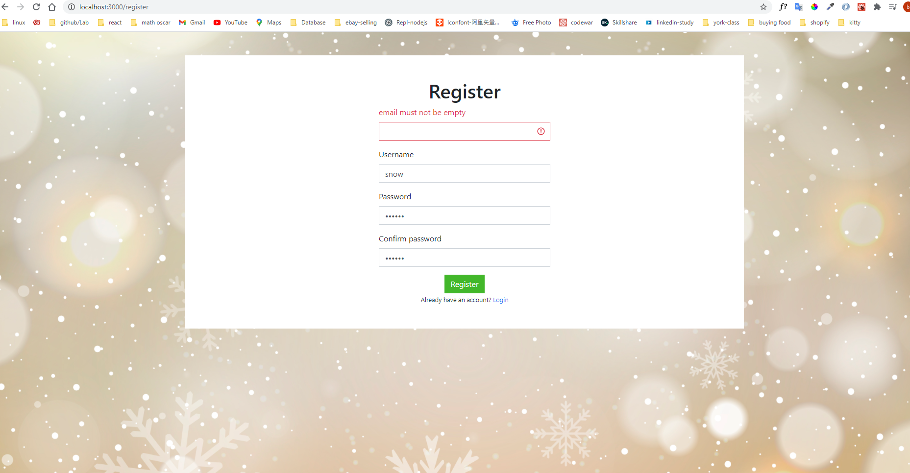
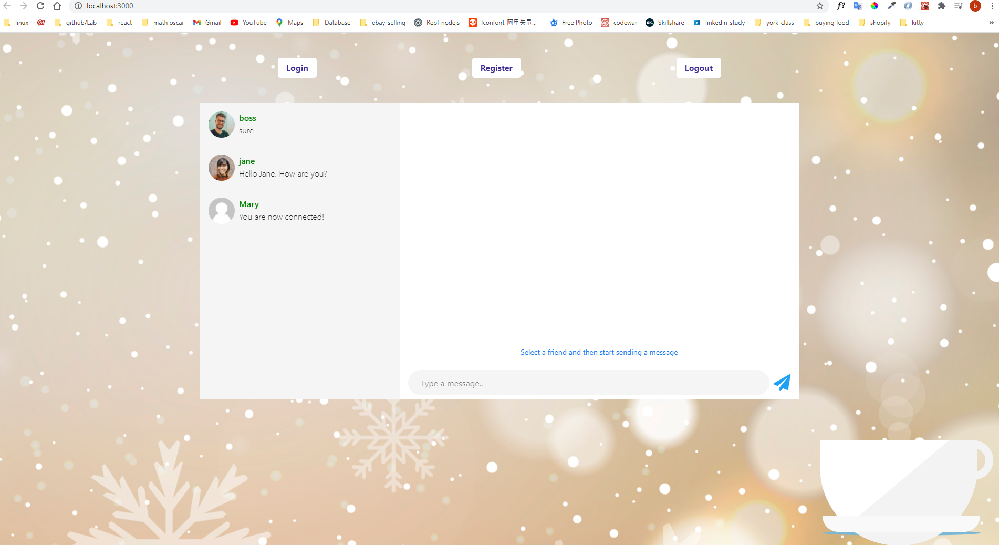

### Graphql chat app client side (Apollo React):

backend repo: https://github.com/shijing0628/graphql-chat-app

```
npm start
```

- npm install @apollo/client graphql
- context useReducer
- If people didn't register or login, he cannot see home page content. (util/dynamicroute control this.)
- https://www.apollographql.com/docs/react/data/subscriptions/


<br>


